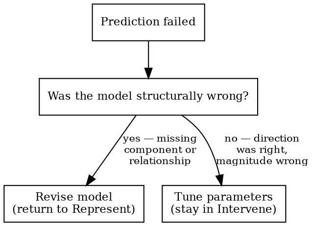

# Representing and Intervening

You must model a system before predicting its behavior, and predict before intervening. Source: Ian Hacking, *Representing and Intervening*.

## Five Phases

| Phase | Action | Gate |
|-------|--------|------|
| **Represent** | State the model: components, relationships, assumptions | — |
| **Predict** | What should we observe? Write it down. | No intervention without written prediction |
| **Intervene** | One change. Compare result to prediction. | One variable at a time |
| **Observe** | Record actual vs. predicted | — |
| **Update** | Prediction wrong? → See Update Decision | — |

**Hard gate:** No fix, bypass, or diagnostic action without first stating what you expect and why.

## Two Modes

- **Lightweight (default):** Natural language model and predictions. Always start here.
- **Formal (opt-in):** Tool-assisted (e.g., prolog-debug-mcp, causal diagrams). Only after lightweight model exists.

## Bainbridge Rule

Human states their model BEFORE any tool formalizes it. Ask: "What's your mental model of what's happening?" Tools check reasoning — they don't replace it.

## Update Decision

Ashby's Law: if the model can't represent the system's variety, no parameter adjustment will fix it.

## Red Flags

Stop and return to Represent if you catch yourself:
- "Let me just try..." (intervening without predicting)
- Reaching for a tool before the human has spoken
- "Close enough" (skipping the observe/update cycle)
- Multiple simultaneous changes (uninterpretable results)
- "It partially worked, let's tune" (may be structural, not parametric)
- Ranking fixes by probability without stating the model they assume

## Rationalizations

| Thought | Reality |
|---------|---------|
| "Trying IS learning" | Predict first, then the result teaches. Without prediction, results are noise. |
| "The tool will figure it out" | No model in → no insight out. |
| "Close enough" | Wrong in a way you haven't identified yet. |
| "The model is implicit" | Implicit models can't be checked or updated. Write it down. |
| "Predicting is overhead" | 30 seconds to predict vs. hours of undirected intervention. |
| "Let me give you a checklist" | Checklist = intervention without representation. Model first. |

## Related Skills

- **systematic-debugging**: Forensic — production is down, what broke? Use for crisis response.
- **design-causal-study**: Pearl's framework is one formalism for the Represent phase.

R&I is epistemic: *how does this work, and what will happen if I change it?*
